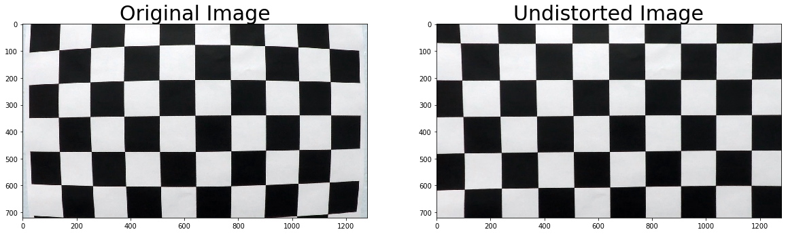
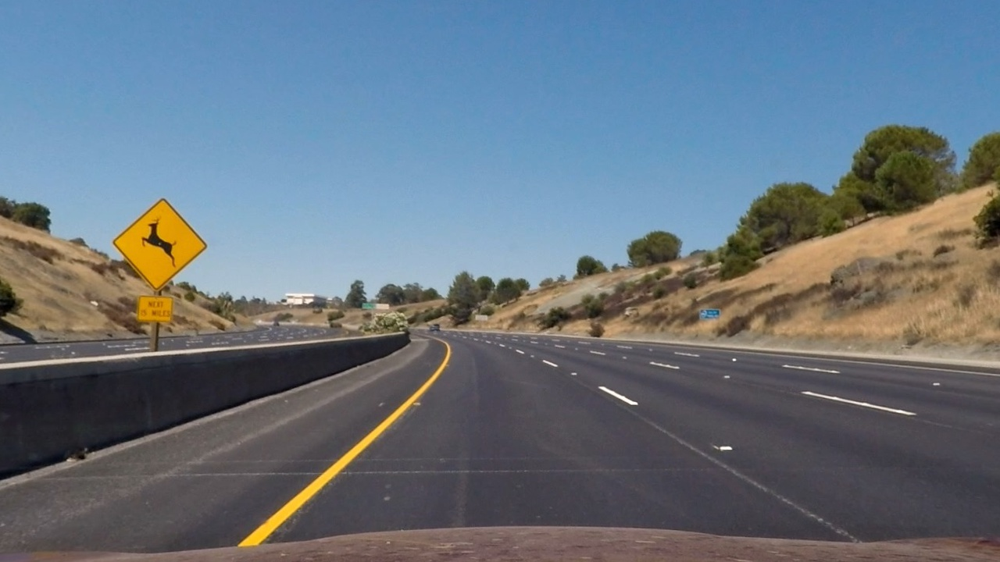
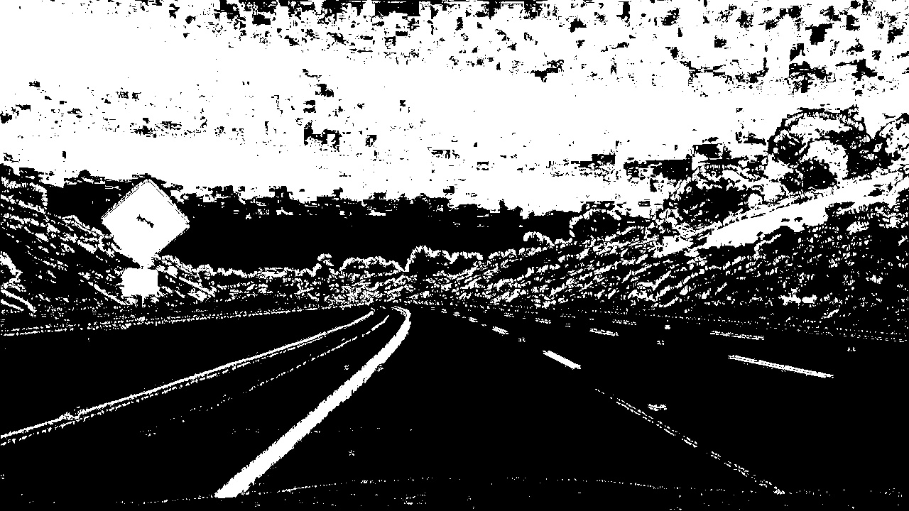
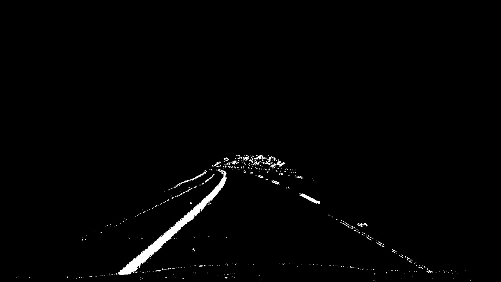
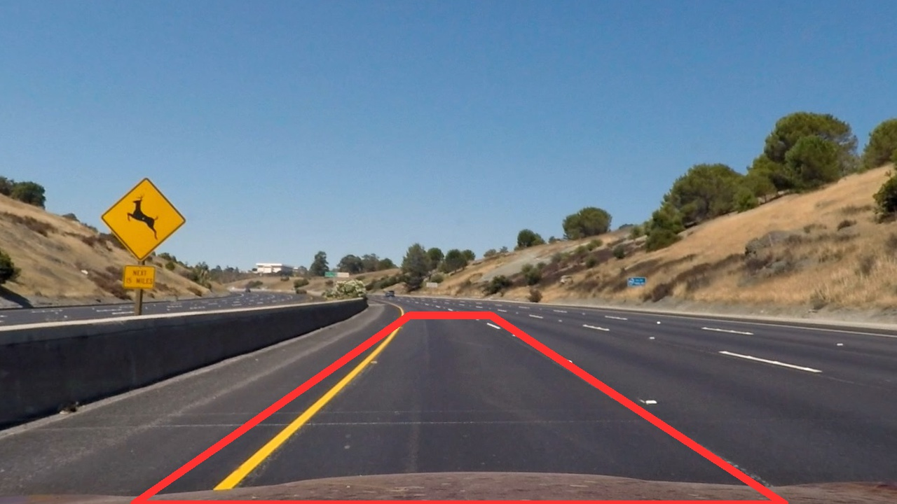
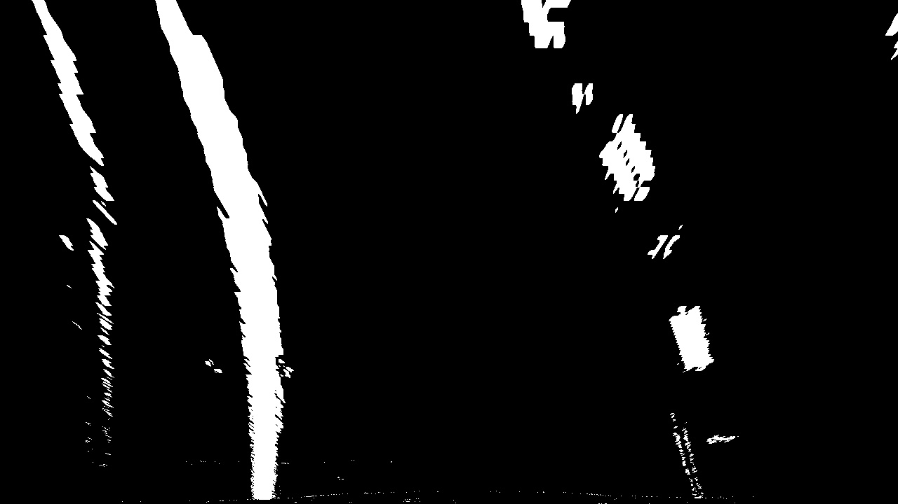
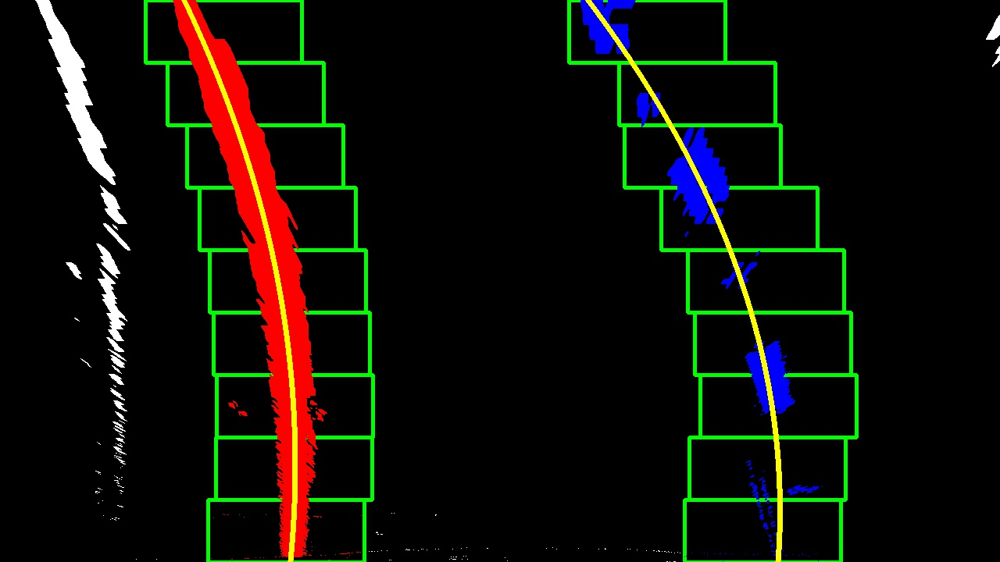
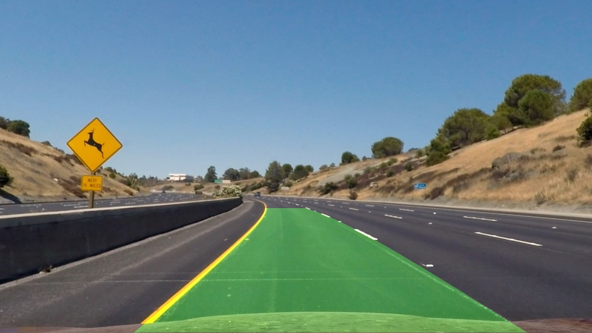
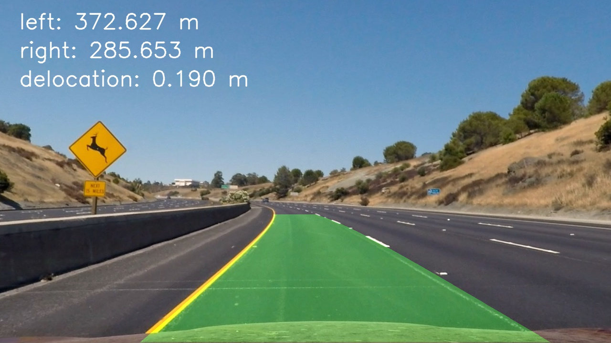

# Advanced Lane Finding Project

The goals / steps of this project are the following:

* Compute the camera calibration matrix and distortion coefficients given a set of chessboard images.
* Apply a distortion correction to raw images.
* Use color transforms, gradients, etc., to create a thresholded binary image.
* Apply a perspective transform to rectify binary image ("birds-eye view").
* Detect lane pixels and fit to find the lane boundary.
* Determine the curvature of the lane and vehicle position with respect to center.
* Warp the detected lane boundaries back onto the original image.
* Output visual display of the lane boundaries and numerical estimation of lane curvature and vehicle position.


## [Rubric Points](https://review.udacity.com/#!/rubrics/571/view) 

Here I will consider the rubric points individually and describe how I addressed each point in my implementation.  

### Writeup / README

#### 1. Provide a Writeup / README that includes all the rubric points and how you addressed each one.  

You're reading it!

### Camera Calibration

#### 1. Briefly state how you computed the camera matrix and distortion coefficients. Provide an example of a distortion corrected calibration image.

The code for this step is contained in the first code cell of the IPython notebook located in [`lane_lines.ipynb`](lane_lines.ipynb).

I start by preparing "object points", which will be the (x, y, z) coordinates of the chessboard corners in the world. Here I am assuming the chessboard is fixed on the (x, y) plane at z=0, such that the object points are the same for each calibration image.  Thus, `objp` is just a replicated array of coordinates, and `objpoints` will be appended with a copy of it every time I successfully detect all chessboard corners in a test image.  `imgpoints` will be appended with the (x, y) pixel position of each of the corners in the image plane with each successful chessboard detection using `cv2.findChessboardCorners`.

```
objp = np.zeros((6*9,3), np.float32)
objp[:,:2] = np.mgrid[0:9, 0:6].T.reshape(-1,2)
```

I then used the output `objpoints` and `imgpoints` to compute the camera calibration and distortion coefficients using the `cv2.calibrateCamera()` function.  I applied this distortion correction to the test image using the `cv2.undistort()` function and obtained this result: 




### Pipeline (single images)

#### 1. Provide an example of a distortion-corrected image.

To demonstrate this step, I will describe how I apply the distortion correction to one of the test images like this one.
I used the undistort function using the camera calibration and distortion coefficients determined earlier.
```
undistorted_image = cv2.undistort(image, mtx, dist, None, mtx)
```




#### 2. Describe how  you used color transforms, gradients or other methods to create a thresholded binary image. 

I used a combination of color and gradient thresholds to generate a binary image (found in `process_image` method in [`lane_lines.ipynb`](lane_lines.ipynb)):

```
gradx = abs_sobel_thresh(image, orient='x', sobel_kernel=3, thresh=(12, 255))
grady = abs_sobel_thresh(image, orient='y', sobel_kernel=15, thresh=(25, 255))
s_binary = get_s_channel_binary(image, thresh=(100, 255))
v_binary = get_v_channel_binary(image, thresh=(50, 255))

combined = np.zeros_like(undistorted_image[:,:,0])
combined[  ((s_binary == 1) & (v_binary == 1)) | ((gradx == 1) & (grady == 1))]  = 1
```
Here's an example of my output for this step.  



Afterwards the pixels outside the area of interest are discarded. 
This is the output:




#### 3. Describe how you performed a perspective transform.

The code for my perspective transform appears in `process_image` method in [`lane_lines.ipynb`](lane_lines.ipynb)). 
The points were identified using the straight-line images. 
I chose the hardcode the source and destination points in the following manner:

```
src = np.float32([[190, 720],[584, 450],[700, 450],[1120, 720]]);
dst = np.float32([[300, 720],[300, 0],[980, 0],[980, 720]]);
```

This resulted in the following source and destination points:

| Source        | Destination   | 
|:-------------:|:-------------:| 
| 190, 720      | 300, 720      | 
| 584, 450      | 300, 0        |
| 700, 450      | 980, 0        |
| 1120, 720     | 980, 720      |

I verified that my perspective transform was working as expected by drawing the `src` and `dst` points onto a test image and its warped counterpart to verify that the lines appear parallel in the warped image.

```
M = cv2.getPerspectiveTransform(src, dst)
Minv = cv2.getPerspectiveTransform(dst, src)
warped_binary = cv2.warpPerspective(image_binary, M, img_size)
```

The following image shows the source region marked in the original image:



This picture shows the warped image in grayscale:




#### 4. Describe how you identified lane-line pixels and fit their positions with a polynomial?

Then I did some other stuff and fit my lane lines with a 2nd order polynomial kinda like this:
I used a historam and windowing approach in order to identify the pixels which are likely to be within the left or right lane line. 

Then we used a second-order polynomial in order to fit the left or right lane: 
```
left_fit = np.polyfit(lefty, leftx, 2)
right_fit = np.polyfit(righty, rightx, 2)
```
The following image shows the output of the lane-line identificaiton and polynomial fit



#### 5. Describe how  you calculated the radius of curvature of the lane and the position of the vehicle with respect to center.

The code for this calculation appears the in `process_image` method in [`lane_lines.ipynb`](lane_lines.ipynb)). 

First the polygon is fitted for real world coordinates:
```
left_fit_cr = np.polyfit(lefty*self.ym_per_pix, leftx*self.xm_per_pix, 2)
right_fit_cr = np.polyfit(righty*self.ym_per_pix, rightx*self.xm_per_pix, 2)
```
Afterwards, the left and right curverad are calculated 
```
left_curverad = ((1 + (2*left_fit_cr[0]*y_eval*self.ym_per_pix + left_fit_cr[1])**2)**1.5) / np.absolute(2*left_fit_cr[0])
right_curverad = ((1 + (2*right_fit_cr[0]*y_eval*self.ym_per_pix + right_fit_cr[1])**2)**1.5) / np.absolute(2*right_fit_cr[0])
```

The real world coordinates are estimated with the following:
```
self.ym_per_pix = 30/720 # meters per pixel in y dimension
self.xm_per_pix = 3.7/700 # meters per pixel in x dimension
```

And the delocation is calculated using:
```
delocation = (np.abs(leftx_base - rightx_base) - midpoint) * self.xm_per_pix
```

#### 6. Provide an example image of your result plotted back down onto the road such that the lane area is identified clearly.

Finally, the result is warped back into the original image space using the inverse perspective transform:
```
newwarp = cv2.warpPerspective(color_warp, Minv, (image.shape[1], image.shape[0])) 
```

Here is an example of my result on a test image:



Additionally, the current radius of the curvatures and the delocation from the center are printed on the images:




### Pipeline (video)

#### 1. Provide a link to your final video output.  

Here's my [test_videos_output](./test_videos_output/project_video.mp4)

I am using the `LaneDetector` class in order to save relevant values over multiple frames. 
Those include:
* The recent polyfits of the left and right lane
* In order to pick the current polynom parameters, the median over the last `smooth_factor` frames. 
* The current determined polynom is checked for validity - doing several sanity checks. 


### Discussion

#### 1. Briefly discuss any problems / issues you faced in your implementation of this project.  Where will your pipeline likely fail?  What could you do to make it more robust?

Altough the pipeling already worked pretty well for the `project_video` using a combination of thresholding already, a class to store the status of the detection over multiple frames was introduced. 
This enables smoothing of the lane-line borders over multiple frames and can filter-out single frames leading to erroneous output.  

In order to improve the result of the pipeline, the sanity checks have to be optimized and more sanity checks have to be performed. 
For example:
* Making sure that the lane curvature does not change significantly from one frame to another
* Ensuring the fixed distance between the two lines over the whole detected line length

Additionally, the following measurements could also improve the output:
* Improve the thresholding process in order to obtain clearer lane lines. 
* Considering the recent detected lane-line polyfits for the window sliding algorithm. 
